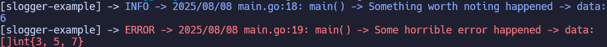

# slogger: simple go logger

This is a small go package that provides two simple logging functions to aid in development

[pkg.go.dev docs page](https://pkg.go.dev/github.com/jesse-rb/slogger-go)


**install in project**

From project directory run:

```
go get github.com/jesse-rb/slogger-go 
```


**example usage**

```
package main

import (
	slogger "github.com/jesse-rb/slogger-go"
)

func main() {
    slogger.LogInfo("main", "Some info.", 2+4)
    slogger.LogError("main", "Some error", 4+0)
}
```

**preview logs**




## References

Referenced [3 bit 8 colours from Haoyi's Programming Blog](https://www.lihaoyi.com/post/BuildyourownCommandLinewithANSIescapecodes.html#8-colors)
as most terminals should supprot this
```
var ansiColors map[string]string = map[string]string {
    "reset":    "\u001b[0m",
    "red":      "\u001b[31m",
    "blue":     "\u001b[34m",
    "black":    "\u001b[30m",
    "green":    "\u001b[32m",
    "yellow":   "\u001b[33m",
    "magenta":  "\u001b[35m",
    "cyan":     "\u001b[36m",
    "white":    "\u001b[37m",
}
```

